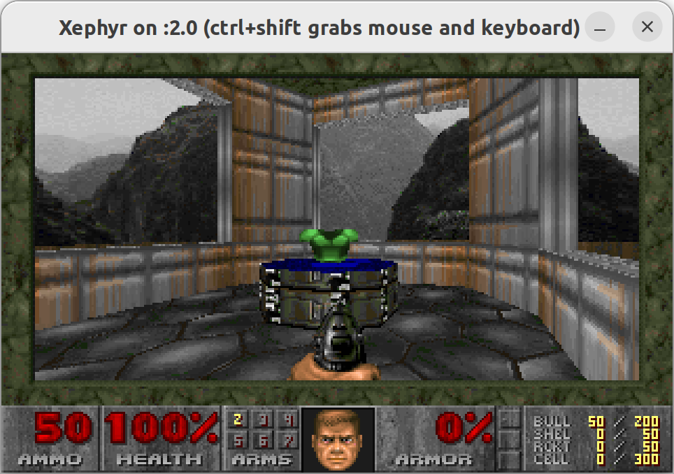

# DOOM



## Setup

- [YouTube](https://www.youtube.com/watch?v=9JgQfQHHhTw&ab_channel=Gabriel_): How To Compile Vanilla Doom (Linux Doom)

### DOOM1.WAD

- Doom Wiki: [DOOM1.WAD](https://doomwiki.org/wiki/DOOM1.WAD)

```bash
linuxdoom-1.10/doom1.wad
```

### Build

```bash
cd linuxdoom-1.10
mkdir linux
make
```

### Graphics

```bash
sudo apt install xserver-xephyr
```

```bash
sudo Xephyr :2 -ac -screen 960x600x8
```

## Run

```bash
DISPLAY=:2
linux/linuxxdoom -3
```

## Controls

- Doom Wiki: [Controls](https://doom.fandom.com/wiki/Controls)

